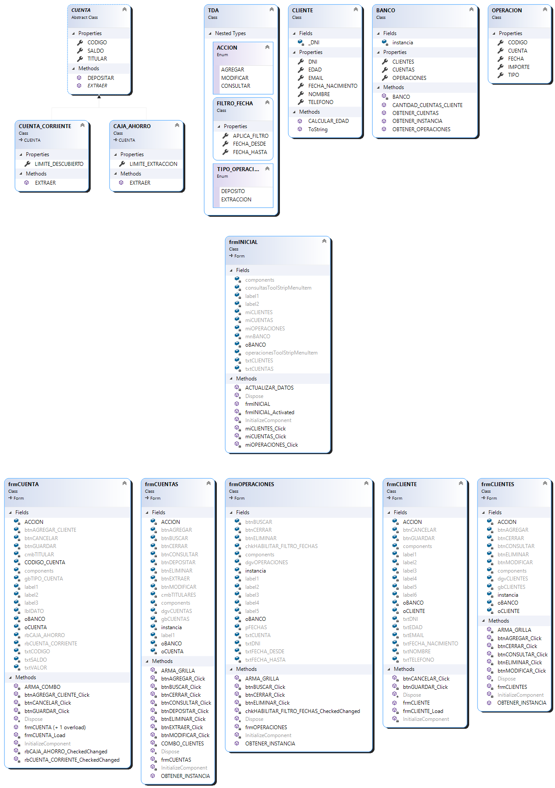
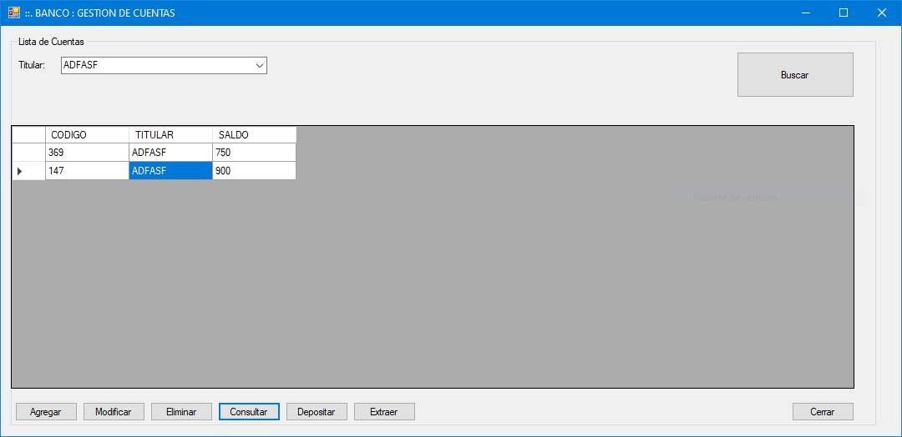
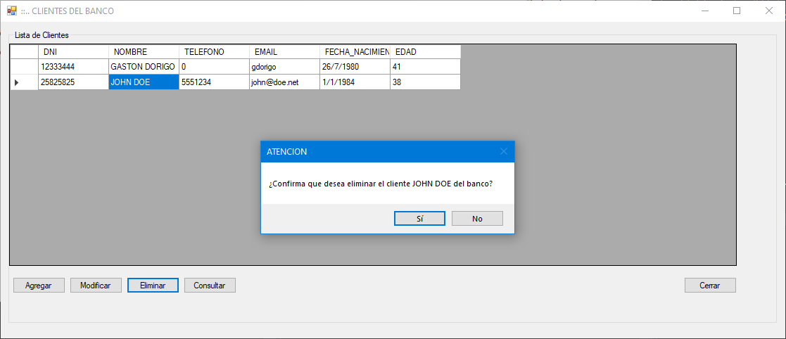

# Ejercicio 1

Resuelva el ejercicio y adjunte diagrama de clases y proyecto en Visual Studio.

## User Stories:

Un banco nos ha solicitado una aplicación que permita gestionar las operaciones de las cuentas otorgadas a sus clientes. Las condiciones son las siguientes:

1. La entidad requiere para cada cliente los siguientes datos:
    - **DNI.** Se debe verificar que no está registrado en otro cliente.
    - **Nombre y apellido.** Verificar que se complete este campo.
    - **Número de teléfono.** Verificar que se complete este campo.
    - **Email para envío de notificaciones.** Verificar que se complete este campo.
    - **Fecha de Nacimiento.** Para calcular la edad del cliente.
2. El cliente puede solicitar más de una cuenta.
3. Cada cuenta solo puede tener asociado un único titular (que debe estar registrado como cliente del banco). Además:
    - Cada cuenta posee un código que la identifica y es único.
    - Posee un saldo en el cual es posible incorporar dinero mediante una operación de depósito o retirar el mismo mediante una extracción.
4. El banco ofrece 2 tipos de cuentas:
    - **Caja de ahorro:** El cliente puede realizar extracciones siempre y cuando posea saldo disponible y no supere el importe máximo permitido por extracción.
    - **Cuenta Corriente:** El cliente puede realizar extracciones siempre y no supere el límite de extracción en descubierto, es decir que se fija un tope de saldo negativo dentro del cual puede realizar extracciones.

## Operaciones:

1. El programa deberá permitir agregar nuevos clientes, modificar los datos de los clientes existentes y eliminar aquellos que no posean cuentas asignadas.
2. También deberá permitir agregar nuevas cuentas, modificar el titular de las mismas o eliminar las cuentas que no posean saldo (saldo igual a cero). Una vez que se define un tipo de cuenta no es posible convertirla a otro tipo disponible (Ej: una caja de ahorro no podría convertirse a cuenta corriente).
3. Los usuarios efectuaran en el sistema las operaciones de depósito y extracción de acuerdo a las características de la cuenta seleccionada:
    - La misma deberá actualizar el saldo de la cuenta de acuerdo a tipo e importe afectado.
    - Se registrará en el sistema: fecha, tipo de operación e importe afectado.
4. El sistema deberá brindar la siguiente información: listado de clientes de la entidad (en este listado es posible encontrar un cliente buscando por número de documento o nombre).

---

### Diagrama de Clases del Proyecto

### Requerimientos

1. Requerimiento 1 cumplimentado. **BUG:** Se agrega la verificación para "*DNI: Se debe verificar que no está registrado en otro cliente*".
2. Requerimiento 2 cumplimentado: 
3. Requerimiento 3 cumplimentado. **BUG:** Se corrije el título del InputBox para extracciones: 
4. Requerimiento 4 cumplimentado.

### Operaciones solicitadas

1. Task 1 cumplimentada: 
2. Task 2 cumplimentada: 
3. Task 3 cumplimentada: 

---

### ToDo

1. Task 4: El Form correspondiente carece de la capacidad de búsqueda de clientes por DNI o nombre.
