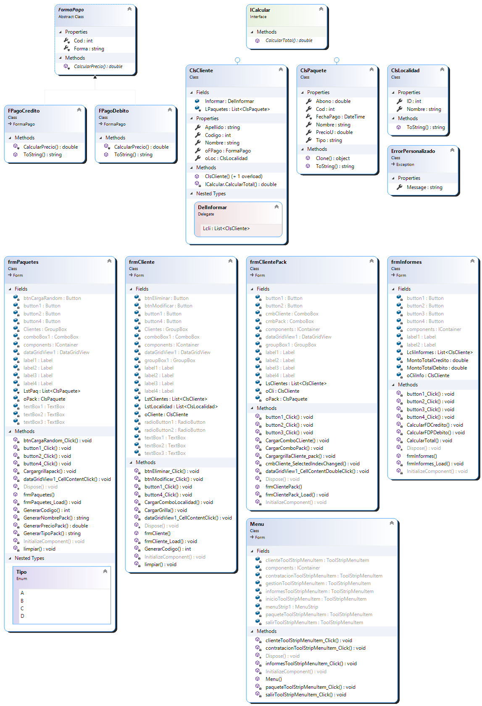
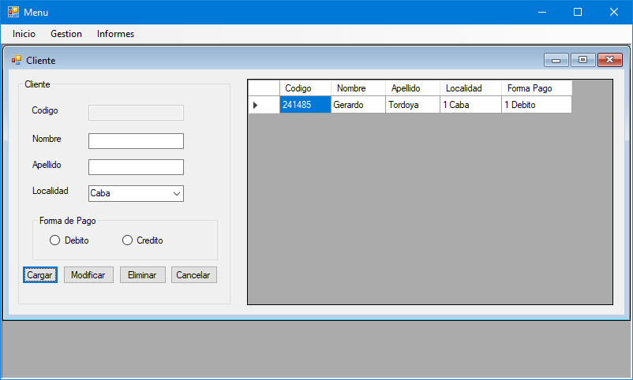
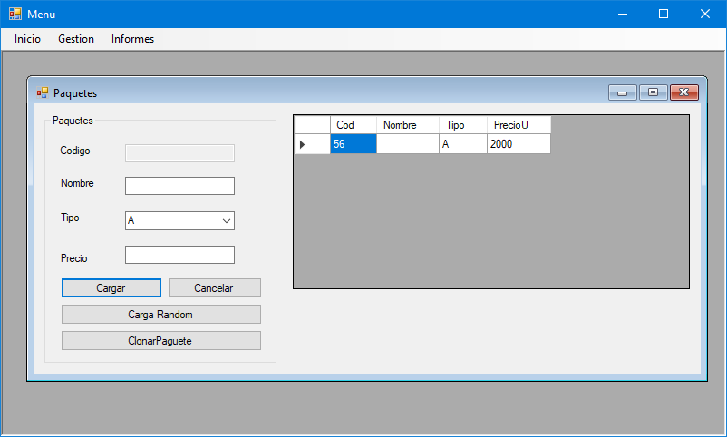
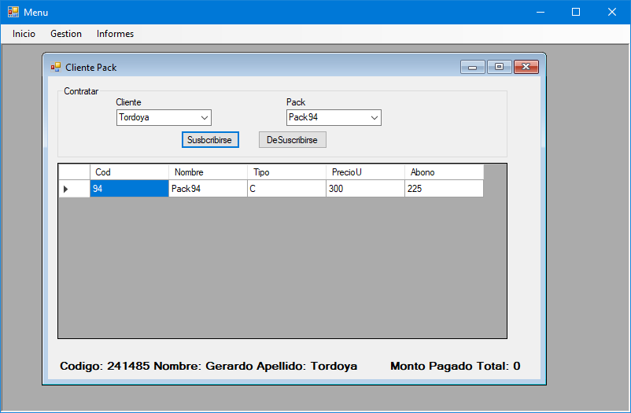

# Ejercicio 2

Resuelva el ejercicio y adjunte diagrama de clases y proyecto en Visual Studio.

## User Stories

Una empresa de cable vende paquetes de promociones. Los paquetes pueden incluir el/los canal/es exclusivo/s. De los canales, se conocen las series, cantidad de temporadas, episodios, duración, ranking, género y director.
En el caso de que el paquete Premium, encarece en un 20 % el abono del cliente, mientras que si es Silver, se incrementa un 15%. De los clientes se conoce el código de cliente, nombre, apellido, DNI y fecha de nacimiento.

## Peticiones

1. Dibujar el diagrama de clases.
2. Crear un formulario Windows MDI y SDI que muestre los resultados.
3. Los campos se llenan por formulario (ABM necesarios).
4. Informar que incluye cada paquete, con sus respectivas series, temporadas y los episodios de las mismas (cantidad y nombre), qué paquete contrató cada cliente (en caso de contratarlo) y los importes de los paquetes incluidos los abonos.
5. Informar el total recaudado mensualmente por la empresa.
6. Informar cuál fue el paquete más vendido, mostrar paquete y series.
7. Informar todos las series de ranking mayor a 3.5

## Inclusiones

1. Namespace distintos en 3 clases
2. Regiones por lo menos en 2 clases
3. Un tipo Enum
4. Utilizar distintos controles para mostrar los informes
5. Utilizar jerarquía de herencia y polimorfismo.
6. Que uno de los constructores sea sobrecargado

---

### Diagrama de Clases

### Cumplimenta User Stories

NO CUMPLE CON LAS USER STORIES:

### Cumplimenta Peticiones

AL NO CUMPLIR LAS USER STORIES, POR ENDE NO CUMPLE CON LAS PETICIONES.

### Cumplimenta Inclusiones

1. NO CUMPLE CON LA 1RA (Todas las clases usan el namespace **Ejemplo_Listas2**).
2. NO CUMPLE CON LA 2DA (Solo hay definidas regiones en la clase **ClsPaquete**)
3. Cumplimenta en **frmPaquetes**.
4. Cumplimenta en **frmInformes** (pero no está claro).
5. No cumplimenta (hereda sin jerarquía) y, en el caso de las interfaces, no sobreescribe el método en común.
6. Cumplimenta en **ClsCliente**.
